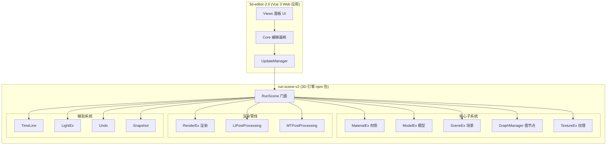
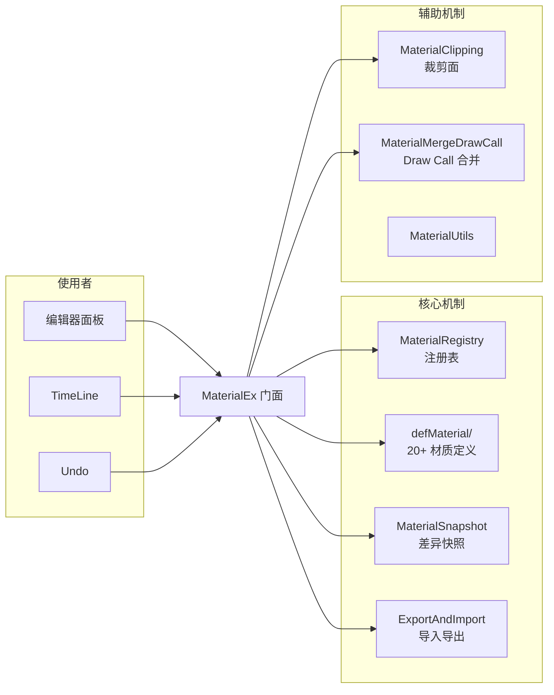
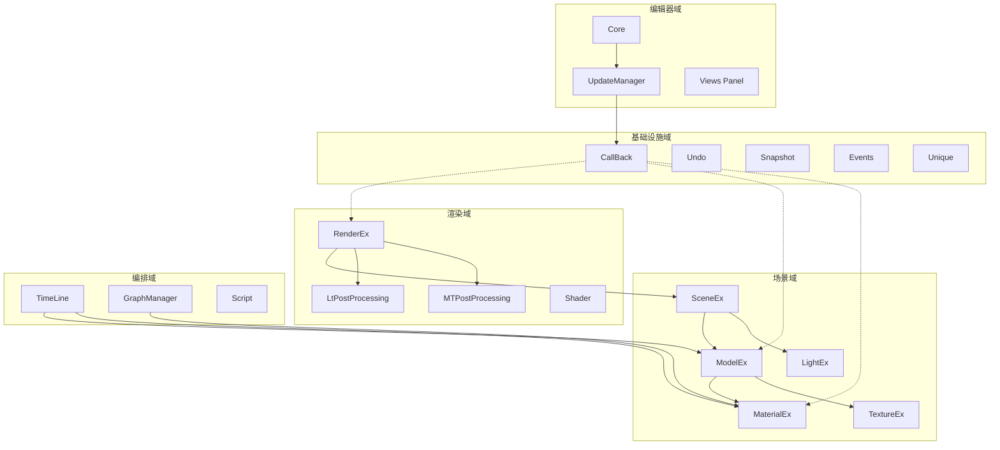

# editorV2 深度架构分析报告

> 分析日期：2026-06-26 | 深度模式（核心模块 ≥90% 覆盖） | 183k 有效代码行

---

## 第一章：项目全景

### 1.1 这是什么？

editorV2 是一个**基于 Web 的 3D 场景编辑器**。用户可以在浏览器中拖入 3D 模型，编辑材质（PBR 物理渲染）、调整光照、添加后处理效果（Bloom/SSAO/SSR 等）、编排时间轴动画——然后用一个"可视化脚本系统"（图节点编辑器）串联出复杂的交互逻辑。最终导出为 GLTF/GLB 格式。

技术上它由两个紧密耦合的子项目组成：



- **run-scene-v2**：npm 包，封装 Three.js（via run-scene-core），提供高层场景/模型/材质/动画/后处理 API。~91k 自研 Ts 行 + ~35k vendored 行
- **3d-editor-2.0**：Vue 3 + TypeScript + Vite Web 应用，含 8 个编辑器面板。~31k 自研行 + ~26k vendored 行（LiteGraph）

### 1.2 为什么需要这个项目？

Three.js 提供了底层 3D 渲染能力，但要构建一个完整的编辑器，还需要：

1. **材质体系**：PBR 材质的可视化编辑、注册、快照、导出为 GLTF——原生 Three.js 全没有
2. **undo/redo**：3D 编辑的原子操作撤销——游戏引擎必备，Three.js 不提供
3. **快照系统**：场景/模型/材质/后处理的序列化与反序列化——Web 编辑器持久化的基础
4. **可视化脚本**：类似 Unreal 蓝图的图节点编辑器——让非程序员编排交互逻辑
5. **多模式部署**：local/network/desktop 三种部署模式——覆盖离线桌面到在线 SaaS

run-scene-v2 在第 2 层（引擎层）提供所有能力，3d-editor-2.0 在第 3 层（UI 层）提供可视化面板。

### 1.3 核心设计哲学

**RunScene 门面模式**是贯穿两个子项目的关键设计选择。RunScene 不是要拆的 God Object——它是故意设计的中央调度器，30+ 子系统通过 `this.rs` 互相引用。这带来了：

- **优点**：子系统之间无需显式依赖注入，初始化顺序由 RunScene 保证，写代码时只需 `this.rs.xxx`
- **代价**：所有子系统共享一个巨型 this，边界模糊，难以独立测试，难以拆分

编辑器层同理：Core 类作为编辑器侧的中央调度器，面板通过 `core.xxx` 访问能力。

整个系统的通讯模式是 **回调驱动**的——编辑器 UI 事件 → UpdateManager → RunScene.cb 命名空间生命周期回调 → 引擎子系统响应。

---

## 第二章：引擎核心 — RunScene 门面

### 2.1 生命周期

```
new RunScene(options) → OptionsEx 初始化
  ↓
init(dom) → initLibs(dom) → 依次初始化 30+ 子系统
  ↓
load({path, dom, loadConfig}) → 下载模型 → 解析 → 添加
  ↓
renderLoop 开始 → 每帧调用 renderEx.render()
```

构造函数非常轻量——只创建 OptionsEx。真正的初始化在 `initLibs(dom)` 中完成，保证了 30+ 子系统的创建顺序可控。

### 2.2 子系统组织

```typescript
// RunScene.ts:85-121 — 30+ 子系统的声明
cb = new CallBack(this)       // 回调总线
script = new Script(this)     // 脚本系统
fileEx = new FileEx(this)     // 文件操作
textureEx = new TextureEx(this)
materialEx = new MaterialEx(this)
modelEx = new ModelEx(this)
sceneEx = new SceneEx(this)
lightEx = new LightEx(this)
// ... 20+ 更多
graph = new GraphManager(this) // 图节点
ltPP = new LtPostProcessing(this) // 后处理
```

每个子系统构造函数接收 `rs: RunScene`，通过 `this.rs` 访问 RunScene 的任何能力和任何其他子系统。这不是传统的 DI（依赖注入），而是"全引用"模式。好处是不需要声明依赖，坏处是无法静态分析依赖关系。

### 2.3 回调系统（CallBack）

CallBack 是 RunScene 的**事件总线**——采用命名空间化的 Observer 模式：

- 每个业务域有独立的 `BindEvent` 命名空间（如 `cb.load`, `cb.renderEx`, `cb.modelEx`）
- 回调通过字符串 name 标识，支持精确注册和移除
- `custom` Proxy 提供按需创建事件的惰性机制
- `inited.cb()` 作为系统就绪信号，`fristFrame` 处理首帧后的初始化操作

编辑器层通过 UpdateManager 向这些回调注册监听器，实现 UI←→引擎的双向通信。

### 2.4 关键设计决策

| 决策 | 选择 | 替代方案代价 |
|------|------|------------|
| 门面 vs 依赖注入 | 门面（全引用 this.rs） | DI 更清晰但需声明依赖，改动成本高 |
| 回调 vs 事件总线 | 命名空间回调 | 通用事件总线更灵活但失去类型安全 |
| 懒初始化 vs 构造时全部创建 | 构造时全部 new | 懒初始化节省内存但引入 null 检查和时序问题 |

---

## 第三章：材质体系深潜

### 3.1 核心定位

MaterialEx 不是 Three.js 材质的替代——它是在原生材质之上的**编辑器能力层**。Three.js 的 MeshStandardMaterial 已经实现了 PBR 渲染语义，MaterialEx 增加的是：

1. **类型注册与路由**：20+ 材质类型通过 `MaterialRegistry` 统一管理（每类实现 `tools` 协议）
2. **撤销/重做**：材质属性的每次修改都记录到 Undo 栈
3. **快照与序列化**：差异快照——只记录与默认值的差异
4. **导入/导出**：GLTF 的 KHR_materials_* 扩展 + 自定义 userData 映射

### 3.2 架构设计



### 3.3 注册表体系（MaterialRegistry）

这是材质系统的**路由中枢**。每种材质类型（Standard、Physical、Fresnel、Glass 等 20+ 种）通过 `RegisterMaterial` 接口注册：

```
RegisterMaterial {
  tools: {
    // 编辑器面板 → Coms 配置生成
    coms: (material) => Com[]
    // 写入材质属性
    set: (material, comId, value) => void
    // 生成默认材质
    create: () => Material
    // 解析 GLTF 导入的材质
    parse: (props, textures) => Material
  }
}
```

编辑面板点击一个材质 → 查 `userData.type` → 找到对应的 `tools.coms()` → 动态生成属性编辑器表单。

### 3.4 差异快照机制

与传统全量序列化不同，MaterialEx 采用**差异快照**：

```
defBaseMaterialMap = { Standard: { roughness: 0.5, metalness: 0, ... }, ... }
// 只保存与默认值不同的属性
snapshot = { roughness: 0.2 }  // metalness 没改，不存
```

这大幅压缩了场景文件的体积。但代价是快照依赖默认值的正确性——如果某个 `defMaterial` 的默认值被误改，所有依赖它的材质快照都会出问题。

### 3.5 关键设计决策

| 决策 | 选择 | 为什么 |
|------|------|--------|
| userData.type 标记材质类型 | 字符串标记（非子类化） | 避免与 Three.js 继承链冲突，序列化友好 |
| 差异快照 vs 全量快照 | 差异快照 | 减少 JSON 体积，但引入默认值耦合 |
| 工厂注册表 vs 类型直调 | 注册表路由 | 新增材质类型只需注册，不改调用方 |

### 3.6 发现问题

| 严重度 | 问题 |
|--------|------|
| ⚠️ 中 | MaterialEx 入口文件过大（需实测行数），门面职责膨胀 |
| ⚠️ 中 | defMaterial 目录存在备份文件残留（`*.ts` 副本） |
| ⚠️ 中 | Registry 和 defMaterial 的职责边界模糊——注册表路由和材质定义混在一起 |
| ⚠️ 低 | 快照中的字符串魔法值（如 `type: "Standard"` 硬编码在多处） |

---

## 第四章：模型管理引擎

### 4.1 核心定位

ModelEx 是**3D 场景中所有模型的唯一入口**，覆盖全生命周期：

```
创建/导入 → 添加至场景 → 变换(移动/旋转/缩放) → 克隆/实例化
  → 材质分配 → 分组 → 快照 → 导出 → 删除
```

### 4.2 模型快照

与 MaterialEx 的差异快照不同，ModelEx 采用**全量快照**——保存完整的 transform（position/rotation/scale）和子模型树结构。模型属性值少且多变，差异快照的收益不明显。

SceneEx 本身不主动管理模型——它只负责全局视觉属性（天空盒、雾、环境贴图）。模型通过 `scene.add()` 加入场景树，SceneEx 充当被动的"画布"。

### 4.3 发现问题

- SceneEx 中 `staticMode`（静态模型矩阵优化）处于注释状态——僵尸代码
- ModelEx 主文件 ~2050 行，超过单文件合理规模
- ModelEx 和 SceneEx 之间缺乏正式的"场景变更通知"层

---

## 第五章：图节点引擎

### 5.1 系统定位

图节点引擎是整个编辑器的**可视化脚本系统**——类比 Unreal Engine 的 Blueprint。用户通过拖拽节点、连接线来编排交互逻辑。

### 5.2 双层架构：自研层 + 魔改版 LiteGraph

```
编辑器面板 → GraphManager (自研 13.5k 行) → Graph → GraphBase
                ↕
           LiteGraph Graph.core.js (魔改版 13.4k 行)
```

### 5.3 LiteGraph 魔改评估

22 处 `//hxy` 修改标记：

| 严重程度 | 数量 | 典型修改 |
|---------|------|---------|
| 🔴 深层重写 | 3 | configure()、drawNode()、drawNodeWidgets() 完全重写 |
| 🟡 中等 | 3 | 连接行为、节点尺寸计算 |
| 🟢 浅层补丁 | 16 | CustomShape、扩展方法 |

3 处深层重写意味着**无法直接升级 LiteGraph**。

### 5.4 最优先重构建议

> **P0：剥离 LiteGraph 魔改为扩展点模式**

通过 LiteGraph 的 hook 机制改为扩展，不再修改原始文件。这是图节点引擎长期可维护性的关键。

---

## 第六章：后处理与渲染管线

### 6.1 双系统并存

| 维度 | LtPostProcessing（新 ~9.5k行） | MTPostProcessing（旧 ~3.5k行） |
|------|------|------|
| 效果数量 | 28+ | 4 |
| 底层库 | postprocessing-fork | Three.js EffectComposer |
| 架构 | Config-driven + 延迟初始化 | 直接创建 |

绞杀者迁移模式（Strangler Fig）——新系统逐步覆盖旧功能，旧系统作为 fallback。

### 6.2 Pass 链执行顺序

SSAO → Denoise → AdaptiveSharpen → HueSaturation → ToneMapping → BrightnessContrast → Lut → Bloom → FXAA/SMAA → SSGI → DOF → MotionBlur → Vignette

符合 Post Processing Stack v2 标准实践：空间效果→色彩调整→辉光→抗锯齿→全局光照→相机效果。

### 6.3 发现问题

| 优先级 | 问题 |
|--------|------|
| P0 | Outline/Outline1 95% 重复代码（LtPP vs MTPP 各一套） |
| P0 | SSGI 配置 ~950 行，应拆到独立文件 |
| P1 | RenderEx 的 mode 判断散落各处，缺统一策略模式 |

---

## 第七章：编辑器层

### 7.1 五层架构

```
Views (8 个编辑面板)
  ↓
Core (编辑器核：状态 + 操作)
  ↓
UI (TimeLineUI/UndoUi/GeometryLibs/MaterialLibs)
  ↓
Components (Base.tsx 输入控件 + 动画UI + 按钮/文本)
  ↓
Static (Layout/Drag/WindowManager/Refs 全局状态)
```

### 7.2 Core 初始化流程

```
Core.tsx 构造函数
  → new RunScene({ mode: "editor" })
  → init(dom)
  → 注册面板 (config/content/info-scene/graph/...)
  → 注册 UpdateManager 监听器
  → 开始 renderLoop
```

### 7.3 UpdateManager 通信流

```
编辑器 UI 事件（用户拖拽/点击）
  → UpdateManager 回调注册
  → RunScene.cb.xxx.cb(args)
  ↓ 引擎层响应
引擎层状态变更
  → RunScene.cb.xxx.cb(data)
  ↓ UI 刷新
  → UpdateManager → Vue 响应式更新
```

### 7.4 属性配置面板

config/ 是编辑器最重的面板——根据选中对象的类型动态生成属性编辑器：

```
选中材质 → 查 userData.type → MaterialRegistry.tools.coms() → 生成 Input/Slider/ColorPicker/TexturePicker
选中模型 → CoreModel → 显示 Transform 编辑器 + 材质槽
选中光源 → LightEx → 显示光源类型相关属性
```

38 种组件类型（DomComs）通过注册表动态匹配。

### 7.5 关键发现

- **rightMenu.tsx ~71k 行**（含注释和 JSX 模板）：函数定义与菜单数据声明混在一起，结构性重构需求
- **多选系统三套逻辑并存**：Multi.ts + CoreTexture.selected + multipSelector
- **场景层级树用原生 DOM 实现**：性能好但与其他 Vue 组件风格不一致
- **三种部署模式**：local_dist（离线桌面）/ network_dist（在线 SaaS）/ desktop_dist（Electron）

---

## 第八章：次要子系统速览

| 模块 | 职责 | 关键设计 |
|------|------|---------|
| **Undo** | 撤销/重做 | 7 种策略子类，支持非线性 undoByIndex |
| **CameraEx** | 相机管理 | 透视/正交切换 + 背景控制 |
| **ControlsEx** | 交互 | ConstrainedOrbitControls Y 轴约束消抖 |
| **Anima** | 动画播放 | GLTF 动画 + 自定义补间 |
| **Events** | 键盘/鼠标 | 事件 Key/Model/Mouse 三分类 |
| **Snapshot** | 快照基类 | 极致的开闭原则——子系统注册，与业务解耦 |
| **SpecialEffect** | 粒子特效 | GPU 粒子系统 |
| **WindSimulation** | 风模拟 | 风场 + 障碍物检测 + 粒子 |
| **Script** | 自定义脚本 | 5 种脚本类型（Creator/LineAnima/LookAt/Texture） |
| **Exporter** | 导出 | GLTF + OBJ 双格式 |
| **SubScene** | 子场景 | 独立场景实例 |
| **Loaderer** | 加载 | GLTF/FBX/OBJ 解析 |
| **Unique** | 唯一标识 | 材质/模型/纹理/几何体去重 |

---

## 第九章：Vendored Libs 真相

### 9.1 全景

| 代码库 | 位置 | 行数 | 原始来源 | 魔改程度 |
|--------|------|------|---------|---------|
| LiteGraph | run-scene-v2/libs/Graph/ | 13,437 | jagenjo/litegraph.js | 🔴 深度（3 处核心重写） |
| GLTF Loader | run-scene-v2/libs/loaderer/ | 3,669 | Three.js GLTFLoader | 🟡 中度（格式适配） |
| GLTF Exporter | run-scene-v2/libs/exporter/ | 8,156 | Three.js GLTFExporter | 🟡 中度（自定义扩展） |
| Graph.js（编辑器侧） | 3d-editor-2.0/src/Libs/ | 25,823 | LiteGraph | 🟡 编辑器侧定制的干净版本 |
| realism-effects | run-scene-v2/libs/realism-effects/ | 2,937 | 第三方 | 🟢 轻度 |

### 9.2 最大隐患：LiteGraph 双版本

引擎侧（run-scene-v2/libs/Graph/Graph.core.js）和编辑器侧（3d-editor-2.0/src/Libs/Graph.js）各有一套 LiteGraph，且**修改内容不一致**。引擎侧有 22 处 `//hxy` 魔改（包含 3 处核心逻辑重写），编辑器侧是更干净的版本（只有界面相关的扩展）。

如果未来要升级 LiteGraph，理论上应该：
1. 编辑器侧的界面扩展 → 改为 LiteGraph 标准扩展机制（registerNodeType/hooks）
2. 引擎侧的 3 处核心重写 → 评估是否可以通过标准 API 替代
3. 升级到最新 LiteGraph，回归单一来源

### 9.3 收编建议

| Vendored Lib | 策略 | 理由 |
|-------------|------|------|
| LiteGraph（引擎侧） | 改扩展模式，回归标准 | 可升级性为 P0 |
| LiteGraph（编辑器侧） | 同上 | 消除双版本不一致 |
| GLTF Loader | 升级 + 保留定制 patch | 定制是必要的格式兼容 |
| GLTF Exporter | 同上 | 自定义 KHR 扩展需要保留 |
| realism-effects | 不碰 / npm 替代 | 依赖稳定，无魔改 |

---

## 第十章：跨模块热点分析

### 10.1 六大调用热点

根据 codebase-memory-mcp 的知识图谱分析（9,472 节点 / 40,416 边）：

| 热点 | 入度 | 所属模块 | 问题 |
|------|------|---------|------|
| `MapEx.map` | 501 | Utils | 上帝工具函数，被几乎所有模块依赖 |
| `callback.cb` | 227 | CallBack | 事件总线枢纽——合理的高入度 |
| `addOutput` | 167 | Graph | 图节点输出注册——图引擎高内聚 |
| `getUniqueId` | 159 | Unique | ID 生成器——广泛使用是正常设计 |
| `addInput` | 143 | Graph | 图节点输入注册——同上 |
| `addWidget` | 140 | Graph | 图节点 Widget 注册——同上 |

### 10.2 限界上下文分析

基于各子系统的职责和依赖关系，editorV2 可以划分出以下**限界上下文**：



**当前最模糊的边界**：
- 材质/模型/纹理三者强耦合（材质引用纹理、模型引用材质），但缺乏明确的聚合根
- 双后处理系统跨越渲染域的两个版本
- CallBack 被所有域依赖，缺乏领域级别的消息封装

### 10.3 最小切割集

激进重构的第一个目标应该是：**最小化改动量，最大化解耦效果**。

基于当前依赖图，推荐以下"切割点"：

| 切割 | 改动量 | 收益 |
|------|--------|------|
| 统一 LiteGraph 为标准 + 扩展 | 22 处修改改为扩展 | 消除双版本，支持未来升级 |
| 合并 Outline/Outline1 | 删除 1 个文件 + 统一引用 | 消除 95% 重复代码 |
| SSGI 配置外提 | 移动 ~900 行到独立文件 | 降低 LtPostProcessing.ts 复杂度 |
| 多选系统统一 | 合并 Multi/selected/multipSelector 为一个 | 消除三套逻辑并存 |

---

## 第十一章：重构评估与路线图

### 11.1 整体评价

editorV2 是一个**设计意图清晰、执行上积累了大量技术债**的大项目：

**做得好的**：
- RunScene 门面模式下，新增子系统极其容易（new + init + 注册回调）
- MaterialRegistry 的注册表模式——材质类型可扩展性强
- Snapshot 的开闭原则——子系统自己注册快照逻辑，框架不解耦
- LtPostProcessing 的 Pass 链顺序符合图形学最佳实践
- Undo 的非线性历史跳转比传统双栈模型灵活

**需要改的**：
- LiteGraph 魔改阻止升级——这是最大的技术债
- 后处理双体系迁移不彻底
- 编辑器侧事件监听（rightMenu 71k 行）需要结构性拆分
- 模块间通过 `this.rs` 的全引用模式导致边界模糊

### 11.2 重构优先级矩阵

| 优先级 | 范围 | 任务 | 影响 | 风险 |
|--------|------|------|------|------|
| **P0** | 图节点 | LiteGraph 魔改剥离为扩展点 | 🔴 可升级性 | 中：3 处核心重写需找替代方案 |
| **P0** | 后处理 | Outline/Outline1 合并 | 🟡 消除重复 | 低：merge 后全功能回归测试 |
| **P0** | 编辑器 | rightMenu.tsx 按对象类型拆分 | 🟡 可维护性 | 低：纯结构性拆分 |
| **P1** | 渲染 | 后处理双体系 → LtPP 统一 | 🟡 消除混乱 | 中：Safari 兼容性需回归 |
| **P1** | 编辑器 | 多选系统三合一 | 🟡 消除三套逻辑 | 中：三种路径需全回归 |
| **P1** | 材质 | defMaterial 清理备份 + 明确边界 | 🟡 代码整洁 | 低 |
| **P2** | 全局 | 模块间引入领域接口（非 this.rs 全引用） | 🟢 长期架构 | 高：需全模块回归 |
| **P2** | 后处理 | SSGI 配置外提 | 🟡 降低文件复杂度 | 极低 |
| **P2** | 场景 | 清理僵尸代码（staticMode 等） | 🟡 代码整洁 | 极低 |

### 11.3 建议的执行顺序

```
第 1 轮（安全，快速见效）：
  → rightMenu.tsx 按对象类型拆分为 4-5 个文件
  → Outline/Outline1 合并
  → defMaterial 清理备份文件
  → 删除僵尸代码（staticMode 等）

第 2 轮（中等风险，架构改进）：
  → 多选系统统一为一个模块
  → MTPP → LtPP 迁移（Outline 已在第1轮合并，剩下 3 个效果）
  → SSGI 配置外提

第 3 轮（高风险，核心架构）：
  → LiteGraph 魔改剥离为扩展点模式
  → 双版本 LiteGraph 合并为单一来源
  → 编辑器侧 Graph.js 同步到统一版本

第 4 轮（长期愿景）：
  → 模块间引入领域接口替代 this.rs 全引用
  → ModelEx + SceneEx 间引入场景变更通知层
  → 后处理策略模式替代散落的 mode 判断
```

### 11.4 风险与回退策略

- **每条独立 commit**，不用一个大 PR 包含所有改动
- **P0 项每项独立分支**，CI 通过后再合入
- **LiteGraph 剥离**是本项目最大单一风险：建议先 fork 当前版本做 snapshot，在 fork 上完成剥离后再回迁
- **建议先建立回归测试套件**：至少覆盖场景加载/保存/导出全流程

---

> 📊 完整覆盖率数据见 `drafts/08-coverage.md`

---

*报告由 repo-analyzer 深度分析模式生成，6 个子代理并行分析，覆盖 14 个核心模块 + 14 个次要模块。*
