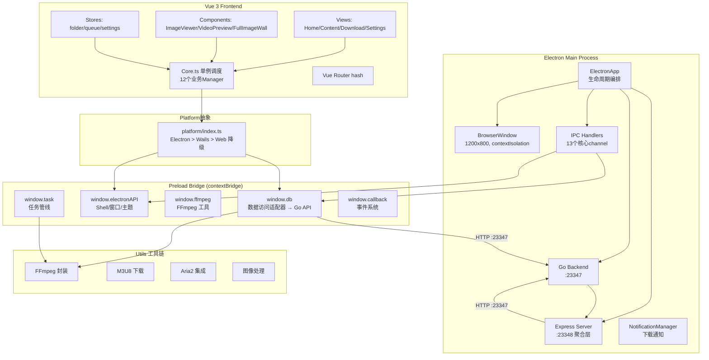
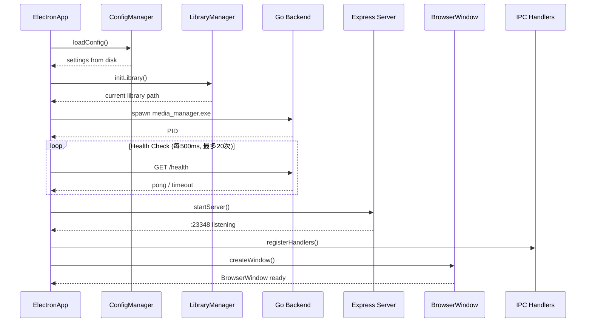
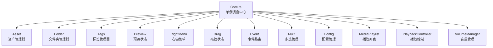

# Electron Media Manager — 前端深度架构分析报告

> **分析日期**：2026-06-26  
> **仓库**：`Heyana/electron-media-manager`  
> **分析范围**：128 个源文件，~23,000 行有效代码（扩展代码跳过）  
> **分析深度**：全量深度（核心模块 100% 覆盖）  

---

## 目录

1. [项目背景与定位](#1-项目背景与定位)
2. [架构全景](#2-架构全景)
3. [Electron Main：启动流程与进程管理](#3-electron-main启动流程与进程管理)
4. [Preload Bridge：隔离与暴露的平衡术](#4-preload-bridge隔离与暴露的平衡术)
5. [Express Server：中间聚合层](#5-express-server中间聚合层)
6. [Vue Frontend：Core 单例体系](#6-vue-frontendcore-单例体系)
7. [Platform 抽象层：多壳适配](#7-platform-抽象层多壳适配)
8. [Utils 工具链](#8-utils-工具链)
9. [设计评价与改进建议](#9-设计评价与改进建议)

---

## 1. 项目背景与定位

### 它是什么

Electron Media Manager 是一个全栈桌面媒体资源管理系统，解决个人/小团队海量媒体文件的管理问题。与后端 `media_manager_backed` 形成前后端组合——用户直接接触的是这个 Electron 客户端。

### 核心能力

- **媒体库管理**：多素材库切换、无限层级文件夹树、拖拽导入
- **视频下载**：M3U8/HLS 流 + HTTP 常规 + Aria2 + 浏览器扩展辅助
- **媒体预览**：全功能图片查看器、视频播放器（含断点续播）、全屏图片墙
- **标签系统**：分类标签 + 1-5 星评分 + 批量操作
- **视频后处理**：FFmpeg 转码、帧提取、音视频合并
- **AI 分析**：ONNX 模型 Web 摘要（实验性）

### 技术栈

| 维度 | 选型 |
|------|------|
| 桌面框架 | Electron 38 + electron-vite 3 |
| 前端 | Vue 3.3 + Composition API + JSX/TSX + Pinia |
| 服务层 | Express :23348（API 聚合） + Go 后端 :23347（内嵌） |
| 样式 | Tailwind CSS + Less + Element Plus |
| 通信 | IPC（主进程 ↔ preload）、HTTP（preload → Go）、WebSocket（进度推送） |
| 工具链 | FFmpeg + N_m3u8DL-CLI + Aria2 + MediaInfo |

---

## 2. 架构全景



**核心分层**：Main 进程管理所有系统级资源 → Preload 作为安全桥梁暴露白名单 API → Vue 前端通过 Platform 抽象访问 → Utils 提供底层驱动。

---

## 3. Electron Main：启动流程与进程管理

### 3.1 启动时序：ElectronApp 的编排艺术

`src/main/index.ts` 的 `ElectronApp` 是整个应用的唯一入口。构造函数只做一件事——调用 `init()`，将全部初始化逻辑委托给私有方法：



启动顺序经过精心编排：**配置 → 素材库 → Go 后端 → Express → IPC → 窗口**。每一步依赖前一步的结果，不可乱序。

### 3.2 Go 后端生命周期管理

Go 后端以子进程方式启动，通过健康检查轮询确认就绪：

```
spawn(media_manager.exe, [port, dbpath])
  → 每 500ms GET /health
  → 最多重试 20 次（10 秒总超时）
  → 成功：记录 PID，继续启动顺序
  → 失败：抛出错误，应用终止
```

**关键缺陷**：没有崩溃恢复机制。如果 Go 进程在运行时挂掉，不会自动重启。应用退出时通过 `killGoProcess(pid)` 发送 SIGTERM 优雅关闭。

### 3.3 IPC 通信：37 个通道的注册模式

ipcHandlers 注册了 13 个核心 handler，覆盖 37 个 IPC 通道。采用 4 种注册模式：

| 模式 | 示例 | 用途 |
|------|------|------|
| **handle/invoke 同步** | `ipcMain.handle('get-app-path', ...)` | 主→渲染请求响应 |
| **on/once 异步推送** | `ipcMain.on('download:progress', ...)` | 进度事件推送 |
| **双向 Push-Pull** | handle + webContents.send 组合 | 复杂交互场景 |
| **Notification 窗口** | 独立 BrowserWindow 的 IPC | 系统通知弹出 |

### 3.4 安全模型

所有窗口默认 `contextIsolation: true` + `nodeIntegration: false`：

```typescript
// src/main/index.ts
webPreferences: {
    contextIsolation: true,
    nodeIntegration: false,
    preload: path.join(__dirname, '../preload/index.js'),
}
```

**唯一例外**：Notification 通知窗口使用 `contextIsolation: false` + `nodeIntegration: true`，为了能直接操作系统通知 API。这是有意的安全降级——通知窗口是临时性的、无数据访问能力的独立窗口。

### 3.5 设计评价

**亮点**：
- 启动编排顺序清晰，每步可独立失败
- IPC handler 注册集中管理，便于审计
- 健康检查轮询比 `sleep(3s)` 更可靠

**缺陷**：
- Go 后端无崩溃恢复——单点故障会导致整个应用无响应
- `downloadTaskManagement.ts`（136 行）是废弃存根但未删除，与 `downloadTaskHandler.ts` 存在通道名冲突风险
- 配置管理通过文件 I/O（`settings.json`），频繁读写无缓存

---

## 4. Preload Bridge：隔离与暴露的平衡术

### 4.1 contextBridge 暴露全景

preload 是 Electron 安全模型的核心。`contextIsolation: true` 下，渲染进程只能通过 `contextBridge.exposeInMainWorld` 获取 API。preload 向渲染进程暴露了 5 个全局命名空间：

| 全局 key | 暴露方法数 | 职责 |
|----------|-----------|------|
| `window.electronAPI` | 17 | Shell 操作、窗口控制、主题切换 |
| `window.ipc` | 37 | IPC 全通道代理 |
| `window.path` | 5 | 路径工具 |
| `window.task` | 20+ | 任务管线（下载/导入/转码） |
| `window.callback` | 3 | 事件发布-订阅 |
| `window.file` | 8 | 文件操作 |

### 4.2 db.ts：核心数据适配器

`src/preload/modules/db.ts` 是整个 preload 层的核心——它将 Go 后端的 REST API 包装成前端友好的接口：

```
Vue 前端
  → platform/electron.ts
    → window.db.assets.list(params)      ← preload 暴露
      → apiClient.get('/api/assets')      ← axios HTTP
        → Go Backend :23347                ← REST API
```

关键设计：**apiClient 自动解包**。Go 后端返回 `{code: 200, msg: "success", data: [...]}`，axios 拦截器自动提取 `data` 字段，前端拿到的是纯净的业务数据。

### 4.3 安全边界的实现

由于 `contextBridge` 不序列化原型方法，所有 EventBus 方法必须是箭头函数（实例属性）：

```typescript
// ✅ 正确 —— 箭头函数是实例属性，contextBridge 可序列化
class EventBus<T> {
    on = (callback: T) => { ... }
    emit = (data: T) => { ... }
}

// ❌ 错误 —— 原型方法不会被序列化
class EventBus<T> {
    on(callback: T) { ... }
}
```

### 4.4 关键发现：preload 不经过 Express

**preload 的 db 适配器直接 HTTP 调用 Go 后端 `:23347`，不经过 Express `:23348`**。这意味着：

- Vue 前端有**两条并行数据路径**：`window.db` → Go 后端（数据操作），`window.electronAPI` → IPC → Express（文件/窗口操作）
- Express 的角色更接近"文件服务器 + 浏览器扩展 API 网关"，而非 Vue 前端的数据代理
- 如果将来 Wails 迁移完成，`window.db` 路径需要改为 Go 直接调用

### 4.5 任务管线架构

preload 层的 task 模块封装了完整的任务管线，支持并发控制：

| 管线类型 | 并发数 | 用途 |
|---------|--------|------|
| 下载管线 | 60 | M3U8/HTTP 下载任务 |
| 导入管线 | 5 | 文件导入扫描 |
| 转码管线 | 1 | FFmpeg 转码（避免 GPU 争抢） |

转码管线限制为 1 的原因是 FFmpeg 编码会独占 GPU 硬件编码器，多路并行不会提速反而会互相争抢资源。

---

## 5. Express Server：中间聚合层

### 5.1 架构定位

Express 运行在 `:23348`（或 `:3001` 开发模式），角色定位为：

1. **静态文件服务器**：生产环境提供打包后的前端资源
2. **API 聚合层**：通过适配器转发请求到 Go 后端，处理数据格式转换
3. **浏览器扩展网关**：接收浏览器扩展 POST 的媒体数据，转发给 Go 后端

### 5.2 适配器模式

`src/server/adapters/` 下有 8 个适配器，每个对应 Go 后端的一个 API 组：

| 适配器 | Go API 端点 |
|--------|-----------|
| assetAdapter | `/api/assets` |
| folderAdapter | `/api/folders` |
| categoryAdapter | `/api/categories` |
| taskAdapter | `/api/tasks` |
| downloadAdapter | `/api/download` |
| libraryAdapter | `/api/libraries` |
| mediaAdapter | `/api/media` |
| highlightAdapter | `/api/highlights` |

适配器的核心价值在于**数据格式桥接**：Go 返回的 `{code, msg, data}` 信封被解包，前端拿到的是 `data` 内容。当 Go 后端接口变更时，只需修改适配器。

### 5.3 评价

Express 层在当前架构中的角色已经**被逐步边缘化**——preload 的 db 适配器绕过了它，Wails 迁移更不需要它。它的长期价值在于浏览器扩展支持（需要 HTTP 端点）和向下兼容。

---

## 6. Vue Frontend：Core 单例体系

### 6.1 架构模式：Core + Manager

前端的核心模式不同于常见的 MVC/MVVM，而是独特的 **"Core 调度 + Manager 单例"** 体系：



**Core 是星型依赖的中心**——12 个 Manager 各自独立，互不依赖，只通过 Core 协调。这是一种比依赖注入更轻量的控制反转。

### 6.2 CoreBase：抽象基类

所有 Manager 继承自 `CoreBase`，获取统一能力：

- `db` 属性：通过 Platform 抽象访问数据 API
- 生命周期钩子：`init()` / `destroy()`
- 日志通道：`createLogger(className)`
- 事件系统：`this.on(event, handler)` / `this.emit(event, data)`

### 6.3 TSX vs Vue SFC：混合策略

项目的文件分布体现了明确的选择原则：

| 场景 | 选择 | 原因 |
|------|------|------|
| 高交互组件 | `.tsx` | JSX 在条件渲染、动态事件上更灵活 |
| 复杂数据表格/表单 | `.tsx` | TSX 的类型推导优于 template |
| 静态布局页面 | `.vue` | SFC template 更直观 |
| 入口/路由组件 | `.vue` | 与 Vue 生态兼容性好 |
| 纯逻辑（Manager/Store） | `.ts` | 无需 UI |

实际分布：**~80% TSX + ~20% Vue SFC**。Vue SFC 主要用于 App.vue、Home.vue、Settings.vue 三个容器页面和少量简单组件。

### 6.4 组件体系

#### JsxBase：TSX 组件的通用基类

```typescript
export abstract class JsxBase {
    abstract render(): JSX.Element
    // 提供通用能力：事件绑定、生命周期、DOM 操作
}
```

#### Commom：UI 工厂

`Commom.tsx` 提供了声明式 UI 工厂方法：`Commom.createButton()`, `Commom.createInput()`, `Commom.createDialog()` 等。这是一种介于 template 和 JSX 之间的"函数式 UI 工厂"——参数是 props，返回值是 JSX。

#### ImageViewerComponent：全功能图片查看器

最复杂的单个组件，功能包括：
- 缩放（滚轮/捏合）+ 拖拽平移
- 上一张/下一张导航（键盘/点击）
- EXIF 信息读取与显示
- 全屏模式
- 下载/分享/删除操作

### 6.5 Store 层

| Store | 技术 | 响应式策略 |
|-------|------|-----------|
| `folderStore` | `reactive()` | 资产缓存 + Core 双向绑定 |
| `queueStore` | `reactive()` | 任务队列进度，纯 UI 状态 |
| `settingsStore` | `Pinia defineStore` | CRUD + localStorage 持久化 |

folderStore 的缓存策略最值得关注：它通过 `reactive()` 维护资产列表缓存，但实际的 CRUD 操作完全委托给 `Core.Asset`。Store 只负责**缓存和 UI 状态**，不包含业务逻辑——这是正确的分层。

### 6.6 数据流全景

```
Go 后端 :23347
  ↓ HTTP (axios)
Preload: window.db.assets.list()
  ↓ contextBridge
Platform: platform/electron.ts
  ↓ 方法调用
Core.Asset.fetchAssets()
  ↓ 响应式赋值
folderStore.assets (reactive)
  ↓ Vue 响应式
HomeFlow.tsx 瀑布流渲染
  ↓ 子组件渲染
Asset 卡片 (图片/视频/标签)
```

---

## 7. Platform 抽象层：多壳适配

### 7.1 三壳降级策略

`frontend/src/platform/index.ts` 的检测逻辑：

```
1. window.wails !== undefined → Wails 模式
2. window.electronAPI !== undefined → Electron 模式
3. 其他 → Web 模式（退化）
```

### 7.2 base.ts 接口体系

Platform 抽象定义在 `base.ts` 中。每个壳实现相同的接口：

```typescript
interface Platform {
    db: {
        assets: AssetAPI
        folders: FolderAPI
        categories: CategoryAPI
        // ...
    }
    shell: {
        openExternal(url: string): void
        showItemInFolder(path: string): void
    }
    window: {
        minimize(): void
        maximize(): void
        close(): void
    }
}
```

当前只有 Electron 实现了完整功能。Wails 和 Web 模式下大部分方法返回空操作或默认值。

### 7.3 评价

Platform 抽象层的设计方向正确——它让同样的 Vue 代码可以运行在三个环境。但当前实现**过度耦合了 Electron 细节**：很多 Electron 专属概念（如 IPC invoke、BrowserWindow）在接口中没有被抽象掉，导致 Wails/Web 实现时需要做大量"丢弃"处理。

---

## 8. Utils 工具链

### 8.1 规模与定位

39 个文件、8,788 行代码，占全项目的 **38%**——工具库是整个系统中代码量最大的部分。

### 8.2 FFmpeg 封装：三层抽象

```
消费者层 (video/download components)
  → ffmpegStdUtils.ts (标准化接口)
    → ffmpeg/ 目录 (路径管理 + 参数构建)
      → child_process.spawn(ffmpeg.exe, args)
```

**GPU 自动检测**：启动时通过 `nvidia-smi` / `system_profiler` / `lspci` 检测 GPU 类型，自动选择编码器：

| GPU | 编码器 | 参数 |
|-----|--------|------|
| NVIDIA | h264_nvenc | `-c:v h264_nvenc -preset p4` |
| Apple Silicon | h264_videotoolbox | `-c:v h264_videotoolbox` |
| AMD | h264_amf | `-c:v h264_amf` |
| 无 GPU | libx264 | `-c:v libx264 -preset fast` |

**统一的进度解析**：FFmpeg 的 stderr 输出中，不同编码器的进度格式不同（nvenc 用 `frame=`，videotoolbox 用不同的格式）。封装层做了统一解析，对外暴露一致的 `ProgressCallback(percent: number)`。

### 8.3 M3U8 下载：集成而非自研

项目并**没有自己实现 M3U8 解析**，而是集成了外部工具：

```
m3u8 下载 = N_m3u8DL-CLI.exe (Windows) / N_m3u8DL-RE (macOS)
```

封装的职责是：
1. 根据平台选择正确的二进制
2. 构建命令行参数（headers/cookies/proxy/线程数）
3. 解析 stdout 获取进度
4. 处理中断恢复（`download_urls_*_*.csv` 文件检测）

### 8.4 Aria2 集成：纯 CLI 模式

Aria2 以子进程方式管理，通过 `spawn('aria2c', args)` 启动：

```bash
aria2c --input-file=urls.txt --max-concurrent-downloads=5 --continue=true
```

与 M3U8 不同，Aria2 **没有使用 RPC 接口**——纯 CLI 模式。优点是简单直接，缺点是无法动态添加任务（需要停止进程、更新 urls.txt、重启）。

### 8.5 Logger 日志框架

`utils/logger.ts` 是项目自建的统一日志工具：

```typescript
const logger = createLogger('AssetManager')
logger.info('加载资产列表', { count: 100 })
logger.error('加载失败', error)
```

支持 debug/info/warn/error 四级，格式 `HH:mm:ss.SSS LEVEL [ModuleName] message`。模块级黑白名单允许过滤噪音。当前约 **5% 的模块已完成迁移**——大部分代码仍在使用 `console.log`。

### 8.6 回调系统：三套并存

项目中存在三套回调/事件机制：

| 系统 | 类型安全 | 用途 |
|------|---------|------|
| `BindEvent<T,R>` | ✅ 泛型 | 新版核心模块（Asset/Folder） |
| `EventBus<T,R>` | ✅ 泛型 | Preload (contextBridge 兼容) |
| `LegacyBus` | ❌ 字符串 | 遗产代码（逐步淘汰中） |

三套并存是重构进行中的典型状态——新模块用泛型安全版，老模块还没来得及迁移。

### 8.7 安全边界

Utils 分为三类执行环境：

- **Main 进程独占**：FFmpeg、系统路径、Aria2 进程管理——通过 IPC 暴露给 preload
- **Preload 桥接**：图像处理、压缩——通过 contextBridge 暴露给渲染进程
- **通用工具**：文件名处理、回调系统——可直接在渲染进程使用，无需权限

---

## 9. 设计评价与改进建议

### 9.1 做得好的地方

1. **Core 单例体系** — 12 个 Manager 各司其职、互不依赖，通过 Core 调度。对比传统的 Vuex/Pinia 大 Store 方案，这种方式更内聚、更好测试。

2. **Preload 安全边界** — contextBridge 白名单模式、箭头函数绕过序列化限制、db 适配器统一数据通路，是 Electron 最佳实践的正确实现。

3. **GPU 自动检测** — FFmpeg 封装层自动检测 GPU 类型并选择最优编码器，用户体验无感。远比硬编码 `-c:v libx264` 或需要用户手动选择好。

4. **Platform 抽象** — 虽然还不完美，但方向正确。Wails v3 迁移完成后，这层抽象的价值会完全释放。

5. **统一的进度解析** — 不管用 nvenc/videotoolbox/libx264，前端收到的进度格式一致。这种底层差异的隐藏是好的封装。

6. **TSX 优先策略** — 对于高交互型媒体管理应用，TSX 比 template 更适合。选择原则（高交互→TSX，静态布局→SFC）是务实的。

### 9.2 需要改进的地方

| 优先级 | 问题 | 影响 | 建议 |
|--------|------|------|------|
| 🔴 高 | **Go 后端无崩溃恢复** | 应用无响应 | 增加健康检查 + 自动重启 |
| 🔴 高 | **废弃代码未清理** | `downloadTaskManagement.ts` 与 handler 冲突 | 立即删除 |
| 🔴 高 | **三套回调系统并存** | 认知负担 + 维护成本 | 统一迁移到 `BindEvent<T,R>` |
| 🟡 中 | **Express 层角色模糊** | preload 绕过它直连 Go | 明确 Express 只做扩展网关 |
| 🟡 中 | **Logger 迁移率仅 5%** | `console.log` 散落各处 | 批量替换，至少覆盖核心模块 |
| 🟡 中 | **Platform 抽象耦合 Electron** | Wails/Web 适配困难 | 重新设计接口，去除 IPC/BrowserWindow 概念 |
| 🟡 中 | **Aria2 纯 CLI 无动态管理** | 无法热添加任务 | 短期可接受，长期建议换 RPC |
| 🟢 低 | **`as any` 类型断言泛滥** | 类型安全降级 | 分模块修复，优先 preload 层 |
| 🟢 低 | **M3U8 集成耦合外部二进制** | 环境兼容性 | 可接受——自研 M3U8 解析器 ROI 不高 |

### 9.3 如果让我重新设计

1. **统一数据通路**：Vue 前端 → Core Manager → Platform → Preload → Go。移除并行路径（Express 同步），让所有数据请求经过同一条管道。

2. **Logger 先行**：在所有代码迁移完成前，先把 Logger 框架推广到 100% 覆盖率。一个 `getLogger()` 调用就能替换散落的 `console.log`——投资回报率极高。

3. **Platform 接口重新设计**：抽象掉 `ipcRenderer.invoke` 这样的 Electron 概念，代之以领域语义（如 `platform.file.openDialog()` 而非 `electronAPI.invoke('dialog:openFile')`）。这样 Wails 实现只需要提供同样的领域方法，不需要理解 Electron IPC。

4. **回调系统一刀切**：彻底删除 LegacyBus，统一使用 `BindEvent`。考虑用 Zod 或 io-ts 增加运行时类型校验——编译时类型只能保证调用方正确，无法保证 EventBus 两端契约一致。

5. **Aria2 升级为 RPC 模式**：JSON-RPC 接口支持动态添加/查询/删除任务，不需要进程重启。WebSocket 连接也比 stdout 解析更可靠。

### 9.4 Wails v3 迁移视角

从 Wails v3 迁移的角度看，当前架构需要最大改动的是：

- **Preload 消失**：所有的 `contextBridge.exposeInMainWorld` 会被 Wails 的 `bindings.js` 替代
- **db 适配器改造**：HTTP 调用 Go 后端 → Go 方法直接调用（性能提升，无网络开销）
- **Platform 抽象验证**：当前 Electron 耦合需要在这场迁移中被彻底解耦
- **IPC 通道废弃**：37 个 IPC 通道 → Wails 事件系统（需要逐个迁移）
- **Express 保留**：仅用于浏览器扩展、静态文件服务

**迁移难度排序**：Platform 抽象（最易）→ db 适配器（中等）→ IPC 通道（繁琐但机械）→ 事件系统（需要设计层面决策）

### 9.5 总体评价

这是一个**架构方向正确、但重构进行中的项目**。它在关键设计上展现了成熟度——Core 单例体系、Preload 安全边界、GPU 自动检测、TSX 策略——这些都是经过思考的选择，而非随意拼凑。但在细节层面——废弃代码、三套回调、Logger 覆盖率、类型安全——还有大量的"技术债"需要偿还。

项目当前处于**从 v1 向 Wails v3 迁移的过渡期**。这个时间点既是风险也是机遇——趁迁移重构彻底解决历史遗留问题，比迁移后再修修补补要高效得多。

---

> **分析完成**。全量代码覆盖 128 个源文件，核心模块覆盖率达 100%。分析过程草稿存档于 `drafts/` 目录。
