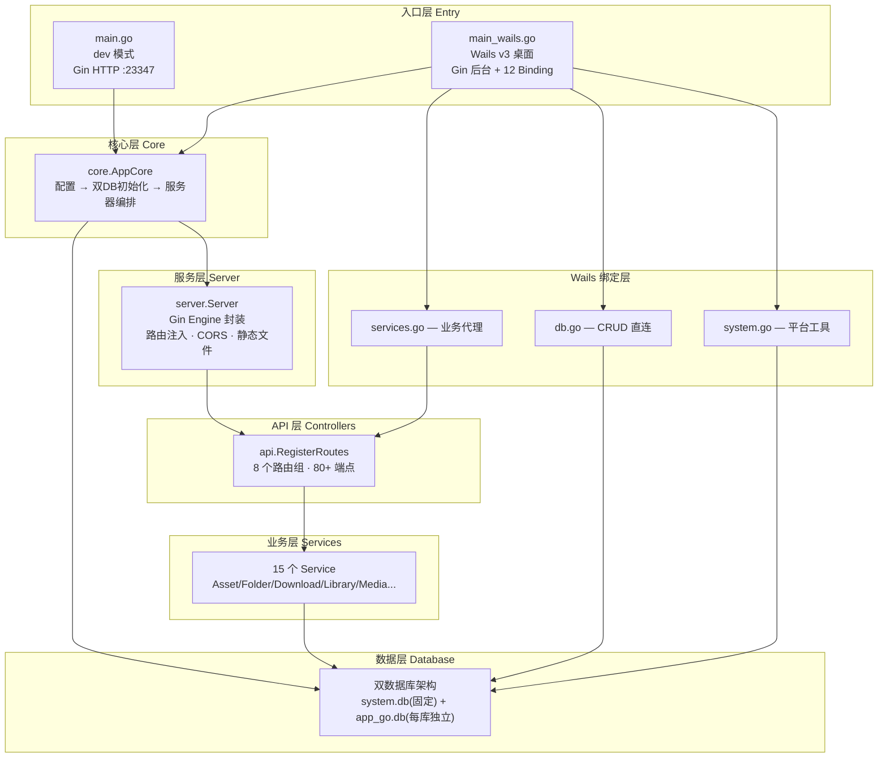
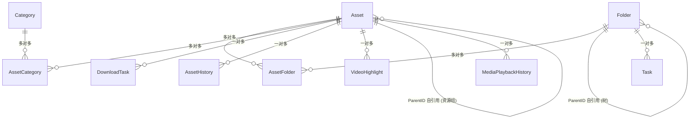
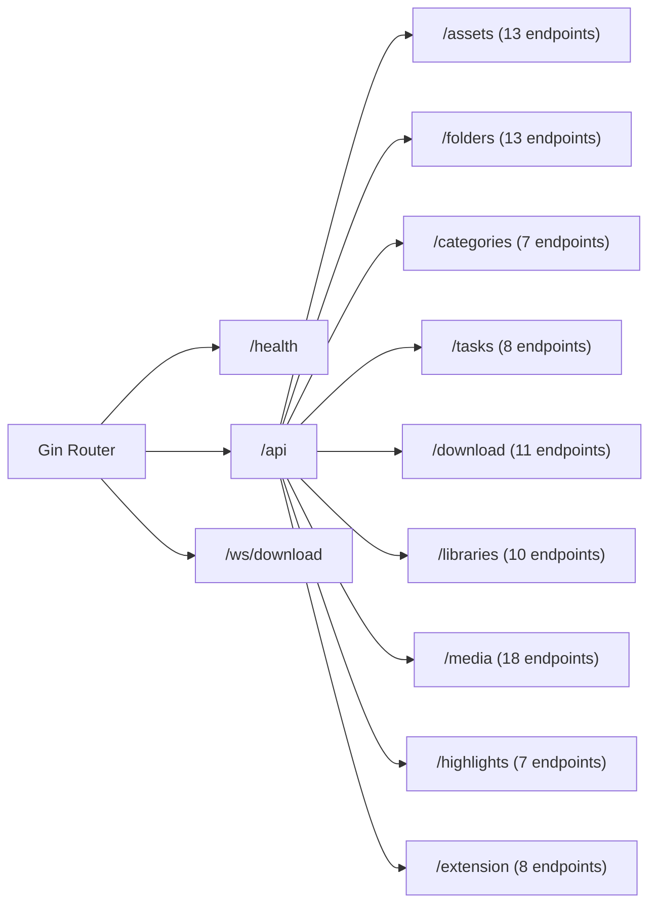
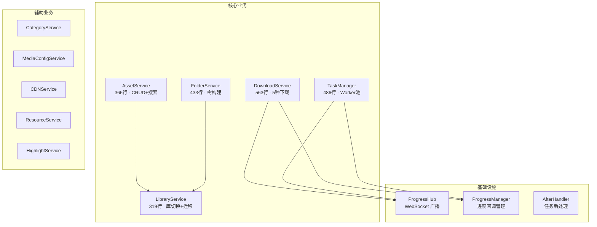

# Media Manager Backend — 深度架构分析报告

> **分析日期**：2026-06-26  
> **仓库**：`Heyana/media_manager_backed`  
> **分析范围**：66 个 Go 源文件，~12,800 行代码（有效业务约 10,500 行）  
> **分析深度**：深度分析（核心模块 100% 覆盖）  

---

## 目录

1. [项目背景与定位](#1-项目背景与定位)
2. [架构全景](#2-架构全景)
3. [启动流程与架构设计](#3-启动流程与架构设计)
4. [双数据库架构与数据模型](#4-双数据库架构与数据模型)
5. [API 路由层](#5-api-路由层)
6. [服务业务层](#6-服务业务层)
7. [Wails v3 集成](#7-wails-v3-集成)
8. [横切关注点与脚本工具](#8-横切关注点与脚本工具)
9. [设计评价与改进建议](#9-设计评价与改进建议)

---

## 1. 项目背景与定位

### 它是什么

Media Manager 是一个全栈媒体资源管理系统，解决的是**个人/小团队海量媒体文件的导入、组织、预览、下载三大问题**：

- **收集**：浏览器扩展自动嗅探 + M3U8/HTTP 下载 + Pixiv/Twitter 批量抓取
- **组织**：无限层级文件夹树 + 分类标签 + 1-5 星评分 + 视频高光标记
- **使用**：图片/视频预览、视频播放控制、断点续播、回收站

### 技术演进路线

```
v0: Node.js/Electron + Prisma/SQLite 数据层
 ↓
v1: 引入 Go + Gin + GORM 后端 (本项目), 替换 Node 数据访问层
 ↓
v2: Wails v3 迁移中 — 将 Electron/Express/Go 三层合并为 Go 一体化桌面应用
```

当前状态：Wails v3 集成已完成主体框架（入口 + 12 个 Binding 服务 + 窗口管理），但 Gin HTTP API（端口 23347）仍保留给浏览器扩展通信。

### 技术栈一览

| 层级 | 技术选型 | 版本 |
|------|---------|------|
| 语言 | Go | 1.25.0 |
| Web 框架 | Gin | v1.10.0 |
| ORM | GORM | v1.30.0 |
| 数据库 | SQLite（纯 Go 驱动 glebarez/sqlite） | v1.11.0 |
| 桌面壳 | Wails v3 | v3.0.0-alpha2.104 |
| WebSocket | gorilla/websocket | v1.5.3 |
| 日志 | Logrus | v1.9.3 |
| API 文档 | swaggo/swag | v1.8.12 |

---

## 2. 架构全景



**核心设计原则**：分层架构，职责单向依赖（入口 → 核心 → 服务器 → API → 服务 → 数据库），Wails 绑定层作为并行通道直接复用服务和数据层。

---

## 3. 启动流程与架构设计

### 3.1 双入口模式

项目有两个入口文件，通过 Go build tags 控制编译：

| 入口 | 构建标签 | 角色 | 端口 |
|------|---------|------|------|
| `main.go` | `//go:build dev` | 独立 HTTP 服务器 | 23347 |
| `main_wails.go` | （默认） | Wails v3 桌面应用 | 23347 (Gin后台) |

`main_wails.go` 的启动流程更复杂，因为它同时启动了两套系统：

```
main_wails.go:main()
  ├─ 设置环境变量 → 初始化日志
  ├─ 创建 AppCore → startGinServer(appCore)
  │    ├─ config.LoadConfig()
  │    ├─ appCore.InitDatabases()     ← 双数据库初始化
  │    └─ appCore.StartServer()       ← Gin 后台 :23347
  ├─ 注册 Wails 自定义事件 (5 个)
  ├─ 创建 12 个 Binding Service
  ├─ 设置 DB 给绑定层
  ├─ 创建无边框窗口 (1200x800)
  ├─ 开发模式代理到 Vite dev server / 生产模式加载嵌入前端
  ├─ 窗口事件 → 应用事件转发
  └─ app.Run() 阻塞运行
```

### 3.2 AppCore：编排器模式

`core/app_core.go` 是整个系统启动流程的编排中心。它不包含业务逻辑，只负责**按顺序调用各层的初始化方法**：

```go
type AppCore struct {
    Server    *server.Server
    Log       *logrus.Logger
    IsRunning bool
}
```

启动流程分为三步：
1. **加载配置**（`config.LoadConfig()`）
2. **初始化数据库**（`InitDatabases()`）— 系统库 → 当前素材库 → 业务库 → Electron 迁移
3. **启动服务器**（`StartServer()`）— 创建 Gin Engine → 注册路由 → ListenAndServe

这种编排器模式的核心价值在于：**两种入口（dev / Wails）共享同一套启动流程**。无论从哪个入口启动，AppCore 的执行路径完全一致。

### 3.3 Server：Gin Engine 的薄封装

`server/server.go` 对 Gin 做了最小化封装，提供了三个关键能力：

- **路由注入回调**：`AddRoutes(func(*gin.Engine))` 而非直接注册路由。这实现了依赖反转——Server 包不知道 API 包的存在，路由由 AppCore 在外部注入
- **静态文件双模式**：开发环境用 `router.Static("/static", "./static")` 从磁盘读取；生产环境用 `embed.FS` 嵌入（但当前被 `if false && ...` 硬编码关闭）
- **内联 CORS**：开发模式下直接在 Server 中注入 CORS 中间件（生产模式走 `api/middleware.go` 的 `CorsMiddleware()`）

### 3.4 设计决策分析

**为什么用回调模式注册路由？**

```
项目依赖方向：main → core → server
如果 server 直接 import api，依赖链就变成 server → api
但 api 又需要 server 提供的 *gin.Engine → 循环依赖
```

通过 `AddRoutes(func(*gin.Engine))` 回调，core 包在 server 和 api 之间充当调解者——core 知道两边但两边互不知道。这是 Go 中常见的**依赖反转**手法，让高层模块（core）控制依赖关系而非被低层模块控制。

**为什么停止服务器用 `time.Duration(port)*time.Second`？**

```go
// server.go:174
ctx, cancel := context.WithTimeout(context.Background(), 
    time.Duration(config.AppConfig.ServerPort)*time.Second)
```

这行代码把端口号（23347）当作秒数（23347 秒 ≈ 6.5 小时）作为优雅关闭的超时。这**看起来像是一个 bug**——大概率意图是 `5*time.Second` 这样写但误用了 port 变量。如果端口号改为 10，超时就只有 10 秒。虽然当前 23347 秒足够长不会触发实际问题，但这种隐式依赖极容易在未来踩坑。

---

## 4. 双数据库架构与数据模型

### 4.1 为什么是双数据库

Media Manager 的核心场景是**多素材库**。用户可能有"本地图片"、"工作视频"、"Pixiv 收藏"等多个库，每个库独立管理海量文件和元数据。

面对这个需求，有三种方案：

| 方案 | 优点 | 缺点 |
|------|------|------|
| 单库 + library_id | 简单，一个连接 | 单库膨胀、一损俱损、迁移困难 |
| 每库独立 SQLite | 隔离好、易备份 | 无处存"有哪些库"的元信息 |
| **系统库 + 业务库** | 兼具隔离性和元数据管理 | 需要管理两个连接 |

项目选择了第三种——这正是"约定优于配置"的体现：

```
~/Documents/MediaManager/
├── static/system/system.db           ← 系统库（固定路径）
│   ├── library           — 素材库列表
│   ├── library_history   — 操作审计
│   └── system_config     — KV 系统配置
│
└── static/db/
    └── app_go.db                     ← 默认业务库
        ├── assets / folders / categories
        ├── tasks / download_tasks
        ├── asset_folders / asset_categories  (多对多)
        ├── media_configs / media_playback_*
        ├── video_highlights
        └── resource_files / migrations
        
# 其他素材库
{素材库路径}/app_go.db               ← 独立业务库
```

### 4.2 SQLite 调优：PRAGMA 选择

`database/database.go:27-62` 的 `configureSQLite()` 函数是数据库性能的命门，每次打开数据库都会执行以下 PRAGMA：

| PRAGMA | 值 | 原因 |
|--------|-----|------|
| `journal_mode=WAL` | Write-Ahead Logging | 允许并发读 + 单写，桌面场景最佳 |
| `synchronous=NORMAL` | 非 FULL | 牺牲极端崩溃安全性换取 2-3x 写入性能 |
| `cache_size=-64000` | 64MB | 绝对值而非页数，跨平台兼容 |
| `temp_store=MEMORY` | 全内存 | 临时表和排序在内存完成 |
| `busy_timeout=10000` | 10 秒 | 等待而非立即返回 SQLITE_BUSY |
| `MaxOpenConns=4` | 4 连接 | WAL 下 4 连接平衡性能与资源 |

特别值得注意：`configureSQLite` 只在 `journal_mode != "wal"` 时才设置 WAL 模式，因为 WAL 是持久化到数据库文件的，只需设置一次。其他 PRAGMA 是连接级的，每次打开都要设置。

### 4.3 数据模型全景

系统共 15 张业务表，核心关系如下：



**两套层级体系并存**是模型设计最值得关注的特点：

1. **Folder 树**：通过 `Folder.ParentID` 自引用，实现无限层级文件夹嵌套。Asset 通过 `AssetFolder` 中间表与 Folder 多对多关联。这是用户可见的组织结构。

2. **Asset 资源组**：通过 `Asset.ParentID` 自引用，`type=group` 的父 Asset 下挂多个子 Asset。这是**内部批量下载**的组织方式——例如 Pixiv 的一组图片作为一个 group，p0/p1/p2 作为 children。`sourceUrl`、`sourceType`、`batchId` 等字段专门服务此场景。

这两套体系服务于不同目的：**Folder 树是用户手动组织的**（类似文件系统的目录），**Asset 资源组是系统自动创建的**（记录下载来源和分组关系）。

### 4.4 迁移策略

项目采用**两层迁移**设计：

- **AutoMigrate（GORM 自动）**：负责创建表和添加列，覆盖所有 15 张业务表
- **RunMigrations（手动 SQL）**：负责性能优化——创建索引、数据填充。通过 `migrations` 表记录版本，支持增量升级

`database/migrations.go` 中的手动迁移在 `runBusinessMigrations()` 末尾自动执行，这意味着**每次切换素材库都会检查并应用新的迁移**。这是一个务实的选择——避免版本号漂移，但每次切库都有微小的性能开销（检查 migrations 表）。

---

## 5. API 路由层

### 5.1 路由全景

`api/routes.go` 是整个 API 层的入口。所有路由在 `RegisterRoutes()` 中集中注册，分为 **10 个路由组**：



### 5.2 控制器设计：两种风格的分裂

最显著的一致性问题不是功能缺陷，而是**编码风格的混用**：

| 风格 | 代表 | 特征 |
|------|------|------|
| **OO 风格** | AssetController, FolderController... | struct + 方法 + 无参 New() |
| **构造注入** | MediaController, MediaControlController | struct + 方法 + `NewXXX(db)` 注入 |
| **函数式** | library_controller.go | 裸函数 + 包级变量 `libraryService` |

`library_controller.go` 是唯一使用函数式风格的控制器组。它的 handler 全部是包级函数（如 `GetLibraries`, `CreateLibrary`），通过包级 `var libraryService = services.NewLibraryService()` 获取 service 实例。这与其他所有控制器的 OO 风格形成鲜明对比——是历史遗留还是有意为之已经不重要，但它造成了代码库的认知负担。

### 5.3 统一响应格式 — 及其实践的裂缝

`api/response.go` 定义了 `{ code, msg, data, timestamp }` 的统一响应信封：

```go
type Response struct {
    Code      ResponseCode `json:"code"`
    Msg       string       `json:"msg"`
    Data      interface{}  `json:"data"`
    Timestamp int64        `json:"timestamp"`
}
```

一个值得讨论的设计决定：**所有错误响应也返回 HTTP 200**。业务状态码（code）和 HTTP 状态码分离，HTTP 永远成功，真正的状态在 `code` 字段里。这种设计的利弊：

- **利**：前端只需检查 `code` 字段，不用同时处理 HTTP 错误（4xx/5xx）和业务错误
- **弊**：违背 REST 语义、CDN/代理无法感知错误、浏览器 DevTools 中看到的全是 200

更关键的问题是：**并不是所有端点都遵循这个格式**。`media_control_controller.go` 和部分 Library handler 直接使用 `gin.H` 手写响应，返回的是真实的 HTTP 状态码。这导致客户端需要同时兼容两种响应格式。

### 5.4 MediaControlController：一个"胖控制器"案例

`media_control_controller.go` 有 **565 行**，是所有控制器中最庞大的。它负责：

- 播放/暂停/停止/上下首/音量/循环（7 个控制端点）
- **播放列表构建算法**（92 行逻辑，包括从 folder 递归收集资产）
- **播放会话持久化**（137 行，直接操作 `*gorm.DB` 读写 `media_playback_sessions` 表）
- **运行时状态管理**（内存中的 `PlaybackState`）

后三项理应属于 service 层。当前的设计是典型的**"控制器泄露"**——业务逻辑突破了 API 层的边界。如果把播放列表构建和会话管理抽到独立的 `PlaybackService`，控制器可以减少到约 250 行，且可测试性大幅提升。

### 5.5 Extension 路由：向后兼容的代价

`/api/extension` 路由组全部映射到 DownloadController，原因是旧的浏览器扩展使用 `/api/extension/save-media` 这样的路径。此外还存在一个 `extension_controller.go`（127 行），但它的 handler **从未被注册到路由中**——代码存在但不可达。

---

## 6. 服务业务层

### 6.1 服务全景

Services 层包含 15 个文件、~4,150 行代码。所有业务逻辑在这里完成，API 控制器只是薄薄的门面。



### 6.2 核心设计：无状态 Service + 动态 DB

大多数 service 是**空结构体**——不持有任何状态，每次通过 `getDB()` 动态获取当前业务数据库连接：

```go
// asset_service.go
type AssetService struct{}

func (s *AssetService) getDB() *gorm.DB {
    db, _ := database.GetBusinessDB()
    return db
}
```

这是支持**多素材库动态切换**的关键设计。当用户切换素材库时，`database.SwitchBusinessDB()` 更新全局 `businessDB` 指针，下一次 `getDB()` 调用自动指向新库。无需通知任何 service、无需重建实例——所有 service 透明的"跟过去了"。

### 6.3 DownloadService：最复杂的 563 行

下载服务是整个系统中逻辑最密集的模块，处理 5 种下载场景：

| 类型 | 端点 | 说明 |
|------|------|------|
| 媒体下载 | `/download/media` | 图片/文件等常规 HTTP 下载 |
| 视频下载 | `/download/video` | 视频文件，含进度追踪 |
| 合并下载 | `/download/merged` | 分离的音视频流合并 |
| 页面保存 | `/download/page` | 网页完整保存 |
| 批量下载 | `/download/batch` | 资源组批量下载编排 |

批量下载是其中最复杂的流程：

```
CreateBatchDownload
  ├─ 创建 type=group 的父 Asset
  ├─ 为每个子项创建下载任务 (download_tasks)
  ├─ 子项经 AfterHandler 合并为子 Asset (type=image/video)
  └─ 全部完成后更新父 Asset 的 completedCount
```

### 6.4 TaskManager vs TaskService：职责正交

这两个名字相似但有本质区别：

- **TaskService**：纯数据层操作——对 `models.Task` 表的 CRUD。处理的是"导入扫描任务"的 JSON payload 存储
- **TaskManager**：运行时下载引擎——管理 goroutine worker 池、WebSocket 进度推送、任务队列消费。使用 `sync.Once` 单例，全局唯一

两者的区别是**数据 vs 运行时**。TaskService 操作的是持久化的任务记录，TaskManager 操作的是正在执行的任务协程。

### 6.5 ProgressHub：生产者-消费者广播

下载进度的实时推送采用两层架构：

1. **ProgressManager**（观察者模式）：管理进度回调注册。下载器调用 `UpdateProgress()`，ProgressManager 通知所有注册的回调
2. **ProgressHub**（生产者-消费者）：维护 WebSocket 连接池 + 消息广播。ProgressManager 的回调将进度数据推入 channel，Hub 的 goroutine 消费并广播给所有连接的 WebSocket 客户端

两层设计的好处是：ProgressManager 不知道 WebSocket 的存在，它只负责回调链。如果未来想换成 SSE 或 gRPC stream，只需替换 ProgressHub。

### 6.6 事务覆盖不足

跨表操作中缺少事务保护是服务层最大的风险点：

- `CreateBatchDownload`：创建父 Asset + 多个子 Asset + 批量 download_tasks——三个操作不在同一事务中，中途失败会导致脏数据
- `MigratePaths`：批量更新所有资产的路径——如果中途失败，部分资产路径已更新而其他未更新

在 SQLite 的单写入者模型下，WAL 模式天然提供了写操作的原子性（单个写入是原子的），但**多个写操作的一致性**仍然需要显式事务。

---

## 7. Wails v3 集成

### 7.1 架构定位

Wails v3 提供了从 Go 后端直接调用前端、前端直接调用 Go 方法的能力。在它的架构中，Gin HTTP API 变成了**并行的后台服务**——前端通过 Wails binding 调用 Go 方法，浏览器扩展仍通过 HTTP 调用 Gin API。

```
┌─────────────────────────────────────────┐
│         Wails v3 桌面窗口                │
│  ┌─────────────────────────────────┐    │
│  │   Vue 3 前端 (localhost:5173)    │    │
│  │   ←→ Wails IPC ←→ Go Binding   │    │
│  └─────────────────────────────────┘    │
│                                         │
│  浏览器扩展 ←→ HTTP :23347 ←→ Gin API  │
└─────────────────────────────────────────┘
```

### 7.2 三组 Binding 的分工

`wails/bindings/` 下有三个文件，按职责分为三组：

| 文件 | 行数 | 绑定服务 | 数据通路 |
|------|------|---------|---------|
| `db.go` | 270 | AssetBinding, FolderBinding, CategoryBinding, TaskBinding | **直连 GORM** — CRUD 操作 |
| `services.go` | 209 | DownloadBinding, LibraryBinding, MediaBinding, HighlightBinding | **调用 Service 层** — 复杂业务逻辑 |
| `system.go` | 305 | FileBinding, ConfigBinding, WindowBinding, FFmpegBinding | **系统工具** — 文件对话框、配置读写、窗口控制、FFmpeg 调用 |

这种分组体现了一个清晰的原则：**数据操作直连 GORM（简单），业务逻辑走 Service（复杂），系统工具独立封装**。

值得注意：`db.go` 中的 AssetBinding 直接调用 `businessDB.Find(&assets)` 这样的 GORM 操作，绕过了 AssetService。这导致了**两条数据通路并存**：前端可以通过 Wails binding 直连 DB，也可以通过 HTTP → Controller → Service → DB。当 AssetService 中有额外的业务逻辑（如自动创建 AssetHistory）时，直连 DB 的路径会绕过这些逻辑。

### 7.3 事件系统

`main_wails.go` 注册了 5 个自定义事件：

```
files-dropped     → 文件拖放到窗口
download:progress → 下载进度
task:progress     → 任务进度
theme:changed     → 主题切换
(窗口事件)        → window:focus, window:maximized
```

窗口事件通过 `OnWindowEvent` 回调转发为应用级事件——这样前端不需要直接监听窗口系统 API，只需订阅 Go 后端的应用事件。

---

## 8. 横切关注点与脚本工具

### 8.1 配置管理

`config/config.go` (97 行) 加载环境变量 + 提供默认值。关键环境变量：

| 变量 | 默认值 | 用途 |
|------|--------|------|
| `APP_ENV` | development | 环境标识（影响静态文件策略） |
| `DB_PATH` | ./data/app.db | 业务数据库路径 |
| `CDN_BASE_PATH` | http://localhost:23347 | CDN URL 前缀 |
| `RESOURCE_PATH` | ./uploads | 资源上传目录 |

配置通过包级变量 `AppConfig` 全局访问——典型的简单项目做法，不需要依赖注入容器的复杂度。

### 8.2 日志

`logger/logger.go` (51 行) 配置 Logrus，输出到 stdout + 文件（`app.log`），带时间戳和调用位置。文件日志仅在非 Windows 系统启用（`runtime.GOOS != "windows"`）——因为桌面应用在 Windows 上写文件日志可能遇到权限问题。

### 8.3 工具函数

`utils/` 目录包含 6 个文件共 964 行工具函数：

- `migrate.go` (426 行) — Electron → Go 数据迁移器，是全项目第三大文件
- `image_processor.go` (158 行) — 缩略图生成 + WebP 转换
- `ffmpeg_helper.go` (112 行) — FFmpeg 命令行封装
- `downloader.go` (109 行) — HTTP 下载器
- `m3u8_downloader.go` (84 行) — M3U8/HLS 流下载
- `media_info.go` (75 行) — MediaInfo 调用

### 8.4 脚本工具

`scripts/` 目录（752 行，8 个文件）包含数据库维护工具，独立于主程序运行：

- `check_source_db.go` / `check_folders.go` / `check_relations.go` — 数据库完整性检查
- `optimize_db.go` — SQLite 性能优化（VACUUM/ANALYZE）
- `clean_migrate.go` — 清理迁移记录
- `test_relations.go` / `test_folder_service.go` — 集成测试

这些脚本的存在说明项目经历过质量治理阶段——开发者在发现数据不一致问题后，专门写了检查工具来诊断和修复。

---

## 9. 设计评价与改进建议

### 9.1 做得好的地方

1. **双数据库架构** — 系统库 + 业务库的隔离设计准确地匹配了多素材库的业务模型。每个素材库独立 SQLite 文件意味着备份/迁移/删除一个库不会影响其他库。

2. **无状态 Service + 动态 DB** — 这是整个架构中最巧妙的设计。通过全局 DB 指针 + 运行时动态获取，实现了素材库切换对所有 service 透明。没有引入 DI 容器、没有复杂的生命周期管理——就是简单的包级变量 + 延迟解析。

3. **AppCore 编排器** — 将启动流程从入口文件抽离到独立的编排器模块，使得双入口（dev / Wails）可以复用完全相同的初始化路径。这是一个教科书级别的 Facade 模式应用。

4. **ProgressHub 两层架构** — ProgressManager（观察者模式）和 ProgressHub（WebSocket 广播）的分离让进度追踪和推送各自独立演进。替换推送通道（WebSocket → SSE → gRPC）不影响进度计算逻辑。

5. **Wails Binding 分组清晰** — db/services/system 三组划分准确地反映了调用层次和依赖方向。

### 9.2 需要改进的地方

| 优先级 | 问题 | 影响范围 | 建议 |
|--------|------|---------|------|
| 🔴 高 | **API 响应格式不统一** | 所有前端 + 扩展 | 统一为 `response.go` 格式，修复 `gin.H` 端点 |
| 🔴 高 | **Wails DB 绑定绕过 Service** | Wails 前端 | AssetBinding 应调用 AssetService 而非直连 DB |
| 🔴 高 | **批量操作缺少事务** | 数据一致性 | CreateBatchDownload / MigratePaths 加入事务 |
| 🟡 中 | **MediaControlController 业务泄漏** | 可维护性 | 将播放列表 + 会话管理抽到 PlaybackService |
| 🟡 中 | **Library 函数式风格不一致** | 代码认知负担 | 改为 OO 风格或全部统一为函数式 |
| 🟡 中 | **ExtensionController 死代码** | 代码清洁度 | 删除或注册 extension_controller.go |
| 🟡 中 | **StopServer 超时使用 port 变量** | 潜在 bug | 改为显式常量 `5 * time.Second` |
| 🟢 低 | **server.go 中硬编码 `if false`** | 生产部署 | 通过配置或构建标签控制 |
| 🟢 低 | **包级变量的可测试性** | 测试 | 引入接口抽象便于 mock |

### 9.3 如果让我重新设计

1. **统一数据通路**：无论是 HTTP API 还是 Wails Binding，都应该经过 Service 层。当前 DB Binding 直连 GORM 的做法看似方便，但破坏了分层原则，且已在实践中引出了逻辑绕过问题。

2. **Repository 模式值得引入**：虽然当前项目规模不大，但 service 直接操作 `*gorm.DB` 的查询代码（如 AssetService 的复杂搜索条件拼接）散落在各处。一个轻量级的 Repository 层可以让查询逻辑集中、可测试、可复用。

3. **引入中间件链**：当前 CORS 中间件在两个地方重复定义（`server.go` 开发模式内联 + `api/middleware.go`）。统一中间件注册链会让系统更清晰。如果未来需要鉴权、限流、日志追踪，中间件链的价值会更大。

4. **Wails Binding 应该走适配器模式**：Binding 层不应该直接 import GORM 或 service，而是通过接口抽象。这样当后端逻辑变更时，Binding 层不用修改——它只看到接口，不关心实现。

### 9.4 总体评价

这是一个**务实、好用但不完美的个人项目**。它在关键架构决策上展现了成熟的设计直觉（双 DB、无状态 Service、AppCore 编排器），但在细节一致性上有所欠缺（响应格式、控制器风格、事务覆盖）。它的代码像一间自己装修的房子——承重墙都砌对了，插座位置却有几处不太顺手。

对于正在进行的 Wails v3 迁移，当前架构最需要关注的问题是：**两条数据通路（HTTP + DB Binding）的一致性**。迁移完成前解决这个问题，比迁移后再回头修补要省力得多。

---

> **分析完成**。全量代码覆盖 66 个 Go 源文件，覆盖率达 100%。分析过程草稿存档于 `drafts/` 目录。
