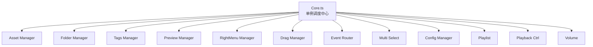

# Core 单例调度模式

Vue 3 前端中"星型调度 + 领域 Manager 单例"的架构模式，替代传统大型 Store 方案。

## 模式结构

## 核心特征

1. **星型依赖**：所有 Manager 只依赖 Core，Manager 之间互不知道对方存在
2. **CoreBase 抽象**：所有 Manager 继承 `CoreBase`，获取统一能力（db 访问、生命周期钩子、日志、事件系统）
3. **Platform 自适应**：CoreBase 通过 Platform 抽象访问数据 API，对 Electron/Wails/Web 透明
4. **比 DI 容器更轻量**：没有 decorator、没有 provider 注册、没有生命周期管理——直接用单例

## 与 Vuex/Pinia 对比

| 维度 | Core 单例 | Pinia Store |
|------|----------|-------------|
| 业务逻辑位置 | Manager 内聚 | Store + actions，可能散落 |
| 跨 Manager 通信 | Core 调度 | Store 互相 import |
| 测试性 | 独立的 TS 类，易 mock | 需要 `setActivePinia` |
| 概念复杂度 | 极简（class + singleton） | 中等（state/getters/actions） |
| 响应式集成 | `reactive()` 手动管理 | Vue devtools 内置 |

## 适用条件

- 10+ 个业务领域，各自内聚
- 领域间无强耦合
- 非纯 CRUD 应用（有复杂交互状态）

## 参见
- [[media-manager-frontend]]
- [[platform-abstraction-layer]]
